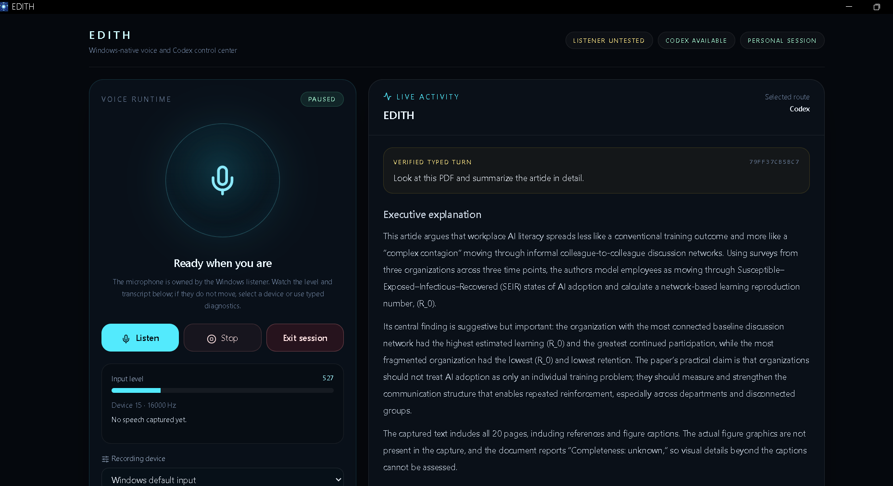
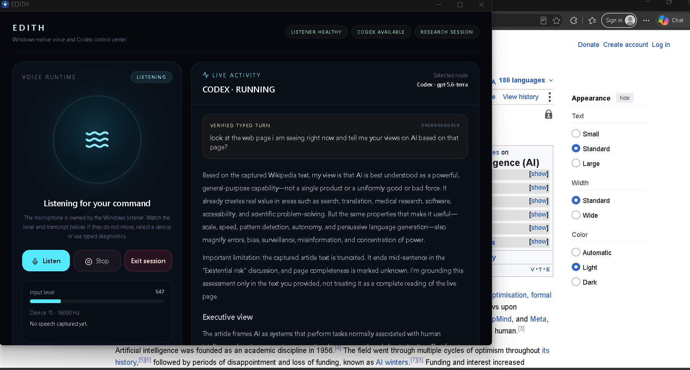

<div align="center">


# <span style="font-family: Georgia, 'Times New Roman', serif; letter-spacing: 0.18em;">E D I T H</span>

### <em>A Windows-native voice interface for documents, research, and engineering work</em>

<p>
  <a href="https://github.com/hemu77/edith-windows-assistant"><strong>🔐 View the private implementation repository</strong></a>
  &nbsp;·&nbsp;
  <a href="mailto:skilaru@arizona.edu?subject=EDITH%20technical%20review"><strong>✉ Request code access</strong></a>
</p>


</div>

## The idea

Most assistants are isolated chat boxes. You upload a file, paste an article, explain your context, and repeat the process for every task.

<span style="font-family: Georgia, 'Times New Roman', serif; font-size: 1.15em;">EDITH is designed around the desktop you are already using.</span>

Press **Win+Shift+E**, speak or type naturally, and EDITH can inspect the foreground document or active web page when you explicitly ask it to. Lightweight requests remain local; complex research and engineering tasks can be routed to Codex with visible status, evidence, and approval boundaries.

## Why it is distinctive

| Capability | EDITH approach |
|---|---|
| Activation | Native Windows hotkey and voice runtime; no browser dashboard required |
| Context | Foreground PDF and active browser context acquired on request |
| Reasoning route | Local model first; Codex for bounded engineering, research, and implementation work |
| Trust | Transcript, source, extraction method, completeness, route, model, and task events are visible |
| Safety | Mutating actions require approval; arbitrary paths and unregistered actions are rejected |
| Lifecycle | Conversational sessions preserve follow-ups and clean up EDITH-owned Codex tasks on stop |

## See it in action

### Local PDF understanding

EDITH captured a 20-page foreground PDF locally and returned a detailed explanation grounded in the extracted document.



### Live web context

EDITH used the active browser page as evidence, routed the request to Codex Terra, and disclosed that the captured article was truncated instead of claiming a complete reading.



## Architecture

```text
Windows hotkey / voice
          ↓
Supervised Windows listener + wake/transcription gates
          ↓
EDITH gateway and session state machine
          ├── Local Qwen: routine conversation and lightweight commands
          └── Codex Luna/Terra: engineering, research, and implementation
          ↓
Native HUD: transcript, context, route, progress, approvals, grounded answer
```

## Technology stack

### Runtime and AI

- **Python 3.10+** with FastAPI-style HTTP/WebSocket gateway routes
- **Local Qwen GGUF inference** through native `llama.cpp`-compatible runtime
- **Codex App Server** integration over a protected local gateway
- **Faster Whisper** speech-to-text with short-command tuning
- **Piper** offline text-to-speech and duplex interruption handling
- **ONNX wake-word and speaker-verification pipeline** with VAD and enrollment support

### Windows and context

- **Windows native host** with supervised listener, hotkey lifecycle, microphone diagnostics, recovery, and tray/exit behavior
- **Edge/Chrome Manifest V3 companion** for active-tab URL, title, selection, headings, and cleaned article content
- **Local PDF extraction** with bounded capture and completeness reporting
- **Tailscale-ready private gateway** for remote clients without public router ports

### Product and web UI

- **React 19 + TypeScript** for the HUD and control surfaces
- **Vite 6** production bundling and **PWA** support
- **Tailwind CSS 4** for responsive visual styling
- **Zustand** for session and conversation state
- **React Router**, **React Markdown**, **Recharts**, **Lucide**, and **Motion** for navigation, grounded output, diagnostics, charts, icons, and interaction
- **Vitest** frontend tests and **Pytest** backend/runtime tests

### Engineering and governance

- SQLite-backed session, turn, task, approval, context, and audit relationships
- Explicit project registry and typed device-action registry
- Third-party provenance and Apache-2.0 attribution records
- Feature flags, rollback-ready listener/model configuration, and local-only diagnostics

## Verification snapshot

- **159** targeted Python tests passed; **1** platform-dependent test skipped.
- **9** frontend authentication tests passed.
- Production TypeScript/Vite build passed.
- Local-PDF and active-web journeys were exercised end to end on the target Windows machine.
- Session shutdown was verified to leave no EDITH-owned Codex task behind.

## Code and technical review

The full implementation is intentionally private because it contains active development work and local-runtime integration details. The public showcase contains documentation and demonstrations only.

<div align="center">

### <span style="font-family: Georgia, 'Times New Roman', serif; font-size: 1.35em;">Interested in reviewing the engineering?</span>

<a href="https://github.com/hemu77/edith-windows-assistant"></a>

<p><strong>Contact: <a href="mailto:skilaru@arizona.edu">skilaru@arizona.edu</a></strong></p>

</div>

## Relationship to OpenJarvis

EDITH is a **newly developed project forked from and informed by OpenJarvis**. OpenJarvis is referenced as the upstream Apache-2.0 foundation and research framework; it is not the product presented here. EDITH has different goals and a separate product direction: a Windows-native voice-first assistant for active desktop context, private local/Codex routing, approval boundaries, and a persistent native HUD.

EDITH-specific runtime, routing, Windows integration, browser companion, task lifecycle, and interface layers are independently developed and maintained. The upstream license and attribution notices are preserved. EDITH is not the official OpenJarvis project and is not maintained by the OpenJarvis authors.

<hr>

<p align="center"><span style="color: red; font-size: 1.25em;"><strong>WORK IN PROGRESS — EDITH is an actively evolving engineering prototype.</strong></span></p>
