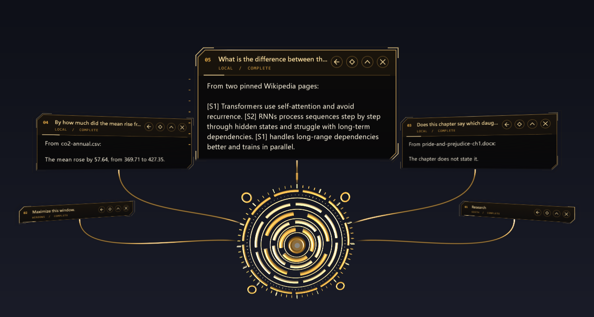

<div align="center">


# E D I T H

### A local-first Windows assistant for documents, desktop context, research, and engineering

<p>
  <a href="https://github.com/hemu77/edith-windows-assistant"><strong>View the private implementation repository</strong></a>
  &nbsp;&middot;&nbsp;
  <a href="mailto:skilaru@arizona.edu?subject=EDITH%20technical%20review"><strong>Request code access</strong></a>
</p>


</div>

## What EDITH is

EDITH is a Windows-native personal AI assistant designed to make interacting with a computer more natural, contextual, and private. Instead of behaving only like a chatbot, EDITH understands the work already in front of the user: a spreadsheet selected in File Explorer, a Word document, a browser article, two pages side by side, or a software project. A request can be spoken or typed into EDITH's transparent golden 3D HUD. Everyday questions and document reading stay on the device with a local model, while complex research and engineering work can be routed through a protected local gateway to Codex. Every answer names the source it came from, says when it only saw part of a page, asks before acting on a window, and verifies outcomes instead of merely claiming success.

## The HUD



*Rendered through EDITH's real native compose path (golden reactor ring plus the 3D message stage). Panel text is taken from October 2026 test runs on public test documents and shortened to fit.*

The HUD is a borderless, per-pixel transparent layer on the Windows desktop. Answers appear as layered holographic panes connected to the reactor by light filaments: the newest answer sits in focus above the ring, earlier answers rest on a curved wall to either side, and each pane can be pinned, folded, dismissed, or swapped into focus with a click. The ring and panes are real geometry rendered with OpenGL in one perspective camera at about 3 to 7 ms per frame on a laptop GPU, with a flat-panel fallback when the GPU is unavailable.

## Current capabilities

### Understands what is on screen

- **Spreadsheets and data files.** Select a CSV in File Explorer and ask "which year has the highest value in this file?" or "by how much did the mean rise from 2000 to 2025?". Differences between named rows are computed exactly by EDITH, not guessed by the model.
- **Word and PDF documents.** Summaries with an exact requested length, follow-up questions, file paths, and an honest "not stated in this chapter" when the text does not contain the answer.
- **Web pages.** Summaries and explanations from the open page, labelled as "the visible part of the page" when that is all that was captured.
- **Two windows side by side.** Ask "what is this page about?" on the left window, click the right one and ask again, then "what is the difference between these two?". EDITH keeps the last two sources it read and compares them, tagging each fact with the source it came from.
- **Conversation memory within a session.** "Give an example of that" refers to EDITH's last answer; data questions after "use this window instead" stay on the chosen file.

### Acts carefully

- Window maximize, restore, and minimize only after a spoken confirmation that names the exact target window ("Maximize Transformer - Wikipedia? To confirm, say: Yes, EDITH, I confirm this window action."). "No, don't do it" cancels without touching anything.
- Volume, mute, media, scrolling, and navigation through a typed action allowlist; mute and unmute are verified against the real Windows state.
- If the window in front changes to a different application between questions, EDITH asks "Do you mean A or B?" instead of silently reading the new window.

### Stays private and in control

- Native `Win+Shift+E` activation, Personal and Research modes, and a supervised Windows host with a tray menu.
- "EDITH, stop" ends speech and the session, and erases Research working memory; "Exit" closes the HUD and microphone while the local model stays warm for the next activation.
- Local speech recognition, owner-voice verification, and text-to-speech; context is treated as untrusted data, never as instructions.
- Local Windows answers for time, date, battery, clipboard, recent items, and indexed file search.
- Codex routing for bounded repository inspection, research, debugging, and implementation tasks, with task status, continuation, retry, cancellation, and approval.

## Measured on the demo laptop (October 2026)

Live runs on an RTX 3050 Ti laptop, driven through the same listener path voice uses after speech-to-text, with public test documents (NOAA Mauna Loa CO2 annual means, Pride and Prejudice chapter 1 as a Word file, Wikipedia articles open in Edge).

| Request | Time to answer | Result |
|---|---|---|
| "What time is it?", battery level | 0.3 s | Correct, answered by Windows |
| "Explain a mutex in one sentence", then "Give an example of that" | 2.7 s, 3.8 s | Follow-up resolved to the previous answer |
| CSV: highest year / rise from 2000 to 2025 / any methane data? | 6.3 s / 3.8 s / 5.3 s | 2025 at 427.35 / exactly 57.64 / correctly "no, CO2 only" |
| Word: three-sentence summary / who is Mr. Bingley / which daughter marries him | 8.4 s / 6.3 s / 5.2 s | Accurate / accurate / "not stated in this chapter" |
| Web page: three-bullet summary / explain attention in context | 11 to 16 s / 6.4 s | Grounded, labelled as the visible part of the page |
| Split screen: what is this page (left), what is this one (right), what is the difference | 8 to 10 s each, then 6 s | Side-by-side comparison with per-source attribution |
| Restore, maximize, cancel a window action; volume, mute, unmute | 0.3 to 0.5 s | Native window and audio state verified |
| "EDITH, stop" while speaking | 0.4 s | Speech and session stopped, nothing resumed |

Automated suite: 1,686 tests passing (4 skipped) across routing, perception, document reading, the HUD and 3D stage, host lifecycle, voice control, and safety checks. Live voice takes of these workflows were recorded on the same laptop.

## How it works

```text
Voice / typed request / Win+Shift+E
                 |
                 v
Supervised Windows host and session runtime
                 |
                 v
Capture + transcription + source binding + deterministic routing
       |                 |                 |
       v                 v                 v
Windows-native       Local Qwen3-4B    Codex
facts and controls   documents, data,  research and
                     conversation      engineering
       |                 |                 |
       +-----------------+-----------------+
                         |
                         v
Golden 3D HUD: source-named answers, layered panes, progress, and errors
```

## Technology stack

### AI and voice

- Python, Pydantic, FastAPI-style HTTP/WebSocket routes, and SQLite persistence
- Qwen3-4B GGUF served locally through `llama.cpp`, with multi-pass analysis for long documents
- Faster Whisper for offline speech-to-text and Silero VAD for speech segmentation
- ONNX wake-word and owner-voice verification
- Local text-to-speech with barge-in ("EDITH, stop") and pause/resume listening
- Codex App Server integration through an EDITH-owned gateway

### Native Windows and perception

- Win32 APIs through Python `ctypes`
- Windows UI Automation with cached, bounded traversal and a local OCR fallback
- Trusted file locators for File Explorer selections and Word's active document
- Local text, CSV, DOCX, and PDF extraction with source, method, and coverage reporting
- Source binding per session: "use this window instead", automatic source pinning, and a guard against silently switching applications
- Local IPC between the Windows host, listener, and HUD

### Interface

- ModernGL/OpenGL reactor ring and 3D message stage in one perspective camera, 4x MSAA, composited offscreen
- Hover tilt, click-to-focus, pin, fold, and dismiss with homography hit-testing on angled panes
- `UpdateLayeredWindow` per-pixel alpha for a floating transparent desktop surface
- NumPy software painter and flat panels when the GPU context is unavailable or lost
- React, TypeScript, Vite, Tailwind CSS, Zustand, and Vitest for the separate diagnostics surface

### Reliability and governance

- Single-instance host and HUD with bounded runtime recovery
- Typed action allowlist and spoken, target-named confirmation for window operations
- Context treated as untrusted data and fenced off from instructions
- An output guard that refuses answers claiming actions that never ran
- Local-first storage under `D:\EDITH`

## Recent improvements (October 2026)

- Every source-based answer now starts with the name of the source, so a wrong capture is obvious in one second.
- Window-action confirmations name the exact target, and cancellation is honoured.
- Web page summaries run locally from the captured page and say when only the visible part was read.
- Follow-ups such as "give an example of that" resolve to EDITH's latest answer instead of older dialogue.
- Data questions stay on the file chosen with "use this window instead", and row differences are computed exactly.
- Document answers report only what the text states, with "not stated" instead of filling gaps from outside knowledge.
- Split-screen comparison: the last two sources read are kept automatically and compared side by side.
- Speech recognition no longer hallucinates whole commands from its vocabulary prompt, and short commands such as "pin this page" are no longer dropped as noise.
- "Exit" keeps the local model and gateway warm, so the next activation answers in seconds.

## Honest project status

EDITH is a working engineering prototype, not a production-ready autonomous desktop agent. The workflows in the table above were measured live on one laptop; they are not a guarantee for every document, page, or voice. Long documents take time on a 4 GB laptop GPU: about a minute for a 19,000-character Word file and several minutes for a 40-page paper. Web pages are read as far as the window shows them. Scanned PDFs without a text layer are reported as unreadable rather than read with OCR. Arbitrary desktop clicking and typing, unrestricted file opening, mobile control, macOS support, zero hallucinations, and zero false wakes are not claimed. EDITH intentionally does not receive blanket administrator access.

## Code access

The full implementation repository is private because it contains active local-runtime integration and development work. GitHub does not provide a public read-only URL for a private repository: reviewers must be invited to the repository or request access.

<div align="center">

## Interested in reviewing the engineering?

### Contact **skilaru@arizona.edu** for private source-code access or a live demonstration

<a href="mailto:skilaru@arizona.edu?subject=EDITH%20source%20access"></a>

</div>

## Relationship to OpenJarvis

EDITH began as a fork of and reference to the Apache-2.0 OpenJarvis project. OpenJarvis remains the attributed upstream foundation, but EDITH is not presented as the official OpenJarvis product. EDITH's Windows-native host, golden 3D HUD, local/Codex routing, perception records, bounded Windows capture, approval model, task lifecycle, and product direction have been developed for a different goal: a private, context-aware desktop assistant that lives within the owner's operating environment. Applicable upstream license and attribution notices are preserved.

---

<p align="center"><strong>WORK IN PROGRESS: EDITH IS AN ACTIVELY EVOLVING ENGINEERING PROTOTYPE.</strong></p>
